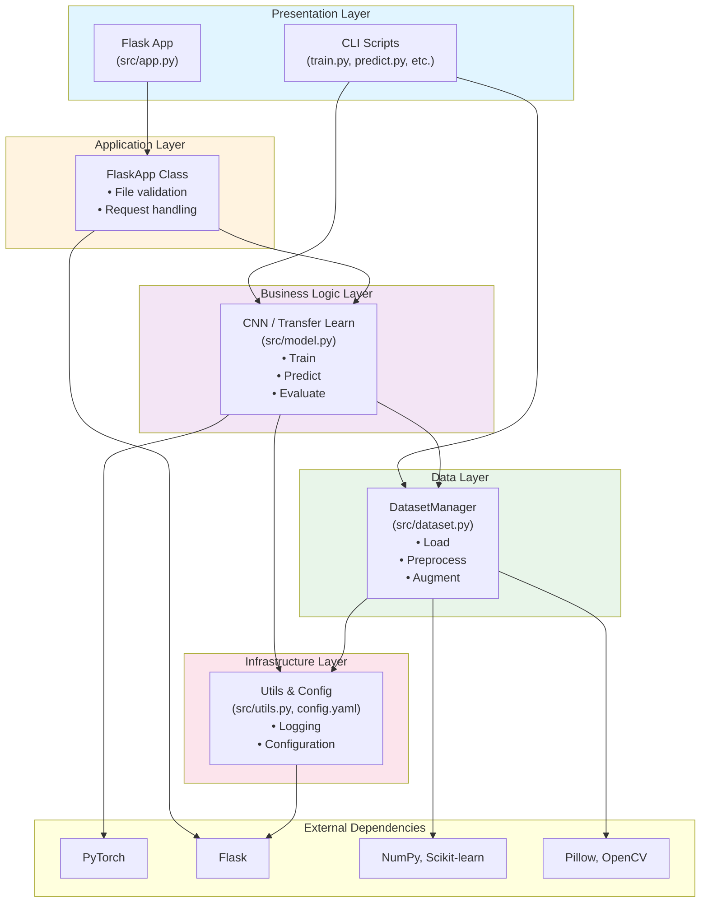

# System Architecture & Design
## Skin Cancer Disease Prediction System

**Phase**: 2 (Analysis & High-Level Design)  
**Date**: 2026-04-08  
**Version**: 1.0  
**Status**: ✅ **APPROVED**

---

## 1. High-Level Architecture

### Layered Architecture Diagram

```
┌────────────────────────────────────────────────────────────────┐
│                         PRESENTATION LAYER                      │
│  ┌──────────────────────────────────────────────────────────┐  │
│  │      Flask Web UI          │        CLI Scripts            │  │
│  │  ├─ GET /                  │  ├─ train.py               │  │
│  │  ├─ POST /predict          │  ├─ predict.py             │  │
│  │  ├─ GET /results           │  ├─ evaluate.py            │  │
│  │  └─ Static files (CSS/JS)  │  └─ app.py (runner)        │  │
│  └──────────────────────────────────────────────────────────┘  │
│                                                                  │
│  ┌────────────APPLICATION LAYER──────────────────────────────┐ │
│  │  AppManager / FlaskApp (src/app.py)                       │ │
│  │  • File upload validation                                 │ │
│  │  • Request routing                                        │ │
│  │  • Error handling & responses                             │ │
│  └────────────────────────────────────────────────────────────┘ │
│                                                                  │
├────────────────────────────────────────────────────────────────┤
│                      BUSINESS LOGIC LAYER                        │
│  ┌────────────────────────────────────────────────────────────┐ │
│  │         CNNModel / TransferLearning (src/model.py)        │ │
│  │  • Model architecture & parameters                        │ │
│  │  • Training loop & checkpoint management                  │ │
│  │  • Inference / prediction                                 │ │
│  │  • Metrics computation & reporting                        │ │
│  └────────────────────────────────────────────────────────────┘ │
│                                                                  │
├────────────────────────────────────────────────────────────────┤
│                      DATA LAYER                                  │
│  ┌────────────────────────────────────────────────────────────┐ │
│  │      DatasetManager (src/dataset.py)                      │ │
│  │  • Metadata loading & validation                          │ │
│  │  • Image preprocessing                                    │ │
│  │  • Data augmentation                                      │ │
│  │  • Batch generation                                       │ │
│  └────────────────────────────────────────────────────────────┘ │
│                                                                  │
├────────────────────────────────────────────────────────────────┤
│               INFRASTRUCTURE / UTILITIES LAYER                   │
│  ┌────────────────────────────────────────────────────────────┐ │
│  │        Utils (src/utils.py) & Config (config.yaml)        │ │
│  │  • Logging setup                                          │ │
│  │  • Configuration management                               │ │
│  │  • File & directory operations                            │ │
│  │  • Helper functions                                       │ │
│  └────────────────────────────────────────────────────────────┘ │
│                                                                  │
├────────────────────────────────────────────────────────────────┤
│                     EXTERNAL DEPENDENCIES                        │
│  PyTorch | Flask | NumPy | Pillow | Scikit-learn | YAML        │
└────────────────────────────────────────────────────────────────┘
```

---

## 2. Module Dependency Graph



---

## 3. Module Responsibility Matrix

| Module | File | Responsibility | Key Classes | Interfaces |
|--------|------|-----------------|-------------|-----------|
| **Presentation** | app.py, train.py, predict.py, evaluate.py | User interaction (web/CLI) | FlaskApp, CLI functions | HTTP routes, argparse |
| **Application** | src/app.py | Request handling, validation, response formatting | FlaskApp | validate_upload(), predict_from_upload() |
| **Business Logic** | src/model.py | Model architecture, training, inference, metrics | CNNModel, TransferLearningModel | train(), predict(), evaluate() |
| **Data** | src/dataset.py | Data loading, preprocessing, augmentation | DatasetManager | load_metadata(), preprocess_image(), augment_image() |
| **Infrastructure** | src/utils.py, config.yaml | Logging, config, utilities | Utility functions | setup_logging(), load_config(), ensure_directory() |

---

## 4. Data Flow Diagram

### Single Image Prediction Flow

```
┌─────────────────┐
│  USER         │
│  (Web Browser) │
└────────┬────────┘
         │
         │ HTTP POST /predict (image file)
         ↓
┌─────────────────────────────────────┐
│  PRESENTATION LAYER                │
│  (Flask Route Handler)              │
│  - Receive file upload              │
│  - Check file size, format          │
│  - Extract filename                 │
└────────────┬────────────────────────┘
             │
             │ File object
             ↓
┌─────────────────────────────────────┐
│  APPLICATION LAYER                 │
│  (FlaskApp.validate_upload)        │
│  - Validate format (JPG/PNG)       │
│  - Check file size (< 10MB)        │
│  - Return: (is_valid, error_msg)   │
└────────────┬────────────────────────┘
             │
            ✓ Valid
             │
             ↓
┌─────────────────────────────────────┐
│  APPLICATION LAYER                 │
│  (FlaskApp.predict_from_upload)    │
│  - Convert to numpy array          │
│  - Pass to model                   │
└────────────┬────────────────────────┘
             │
             │ numpy array (H×W×C)
             ↓
┌─────────────────────────────────────┐
│  DATA LAYER                         │
│  (DatasetManager.preprocess_image)  │
│  - Resize to 224×224               │
│  - Normalize [0,1]                 │
│  - Denoise (optional)              │
│  - Return: preprocessed tensor     │
└────────────┬────────────────────────┘
             │
             │ torch.Tensor (1×3×224×224)
             ↓
┌─────────────────────────────────────┐
│  BUSINESS LOGIC LAYER              │
│  (CNNModel.predict)                │
│  - Load model weights              │
│  - Run forward pass                │
│  - Apply softmax                   │
│  - Return: logits + probabilities  │
└────────────┬────────────────────────┘
             │
             │ {class: prob, confidence: %}
             ↓
┌─────────────────────────────────────┐
│  APPLICATION LAYER                 │
│  (Format response)                 │
│  - Create result JSON              │
│  - Add metadata (time, etc.)       │
│  - Return: HTTP 200 + JSON         │
└────────────┬────────────────────────┘
             │
             │ JSON response
             ↓
┌─────────────────┐
│  USER          │
│  (Web Browser) │
│ See result +   │
│ confidence     │
└────────────────┘
```

**Timing**:
- File upload validation: **< 100ms**
- Preprocessing: **< 500ms**
- Model inference: **1-4s** (CPU)
- Response formatting: **< 50ms**
- **Total SLA: ≤ 5 seconds** ✅

---

## 5. Training Flow (Batch)

```
START
  ↓
[Load config.yaml]
  ↓
[DatasetManager.load_metadata()]
  ├─ Load CSV
  ├─ Validate paths
  └─ Get class distribution
  ↓
[DatasetManager.get_train_val_test_split()]
  ├─ Stratified split (70/15/15)
  └─ Return: train_loader, val_loader, test_loader
  ↓
[CNNModel.build()]
  ├─ Initialize architecture
  └─ Move to device (GPU/CPU)
  ↓
[CNNModel.train()]
  ├─ For each epoch:
  │  ├─ For each batch:
  │  │  ├─ Load augmented images
  │  │  ├─ Forward pass
  │  │  ├─ Compute loss
  │  │  ├─ Backprop
  │  │  └─ Update weights
  │  ├─ Validate on val_loader
  │  ├─ Checkpoint if improved
  │  └─ Log metrics
  └─ Return: best_model_path
  ↓
END
```

---

## 6. Module Interface Specifications

### DatasetManager (src/dataset.py)

**Constructor**:
```python
DatasetManager(dataset_dir: str, target_size: Tuple[int, int] = (224, 224))
```

**Methods**:

| Method | Input | Output | Error Handling |
|--------|-------|--------|---|
| `load_metadata(metadata_csv: str)` | CSV filename | DataFrame | FileNotFoundError if missing |
| `validate_images()` | None | {total, valid, missing[], corrupted[]} | Returns validation results |
| `preprocess_image(image_path: str)` | Path to image | np.ndarray (H×W×3) | IOError if cannot load |
| `augment_image(image: np.ndarray, augment: bool)` | Image array | Augmented array | ValueError if shape invalid |
| `get_class_distribution()` | None | {class_name: count} | ValueError if metadata not loaded |

---

### CNNModel (src/model.py)

**Constructor**:
```python
CNNModel(num_classes: int = 7, input_size: Tuple[int, int] = (224, 224))
```

**Methods**:

| Method | Input | Output | Error Handling |
|--------|-------|--------|---|
| `build()` | None | None (modifies self.model) | ValueError if already built |
| `train(train_loader, val_loader, epochs, lr)` | Loaders | None (saves checkpoint) | RuntimeError if no model |
| `predict(image)` | np.ndarray | {class: str, confidence: float} | ValueError if shape mismatch |
| `evaluate(test_loader)` | Loader | {accuracy, precision, recall, f1, confusion_matrix} | RuntimeError if model not loaded |
| `save(path: str)` | File path | None | IOError if write fails |
| `load(path: str)` | File path | None | FileNotFoundError if not exist |

---

### FlaskApp (src/app.py)

**Constructor**:
```python
FlaskApp(model_path: str, max_file_size_mb: int = 10)
```

**Methods**:

| Method | Input | Output | Error Handling |
|--------|-------|--------|---|
| `create_app()` | None | Flask app instance | RuntimeError if model fails to load |
| `validate_upload(file)` | File object | (bool, error_msg: str) | Checks format & size |
| `predict_from_upload(file)` | File object | {success, class, confidence, error} | Returns structured JSON |
| `run(host, port, debug)` | Config | Runs server | RuntimeError on bind error |

---

### Utils (src/utils.py)

| Function | Input | Output | Purpose |
|----------|-------|--------|---------|
| `setup_logging(log_level)` | str (DEBUG/INFO/ERROR) | None | Configure logging |
| `load_config(path)` | str | Dict | Load YAML config |
| `save_config(config, path)` | Dict, str | None | Save YAML config |
| `ensure_directory(path)` | str | Path | Create dir if not exist |

---

## 7. Technology Stack (By Layer)

| Layer | Component | Technology | Version |
|-------|-----------|-----------|---------|
| **Presentation** | Web UI | Flask | 2.3.2 |
| | Web Server | Werkzeug | 2.3.6 |
| | CLI | Python argparse | builtin |
| **Application** | Request handling | Flask-CORS | 4.0.0 |
| | File validation | Werkzeug | 2.3.6 |
| **Business Logic** | DL Framework | PyTorch | 2.0.1 |
| | Pre-trained models | TorchVision | 0.15.2 |
| | Computer vision | OpenCV | 4.8.0 |
| **Data** | Image processing | Pillow | 10.0.0 |
| | Numeric ops | NumPy | 1.24.3 |
| | Metrics | Scikit-learn | 1.3.0 |
| **Infrastructure** | Config | PyYAML | 6.0 |
| | Logging | Python logging | builtin |
| | Testing | Pytest | 7.4.0 |

---

## 8. Key Design Decisions

### Decision 1: Layered Architecture
**Why**: Clear separation of concerns, easier testing, minimal coupling  
**Alternative**: Monolithic (rejected: hard to test, change propagation)

### Decision 2: PyTorch (not TensorFlow)
**Why**: Pythonic, dynamic graphs, research community (see TECH_STACK_DECISION.md)  
**Fallback**: ONNX export to TensorFlow if needed

### Decision 3: Flask (not FastAPI)
**Why**: Simpler for single-model prediction, faster team ramp-up  
**Fallback**: Can migrate to FastAPI in Phase 6 if performance needed

### Decision 4: Stratified Train/Val/Test Split
**Why**: Imbalanced dataset (67% nevus) requires stratification  
**Alternative**: Random split (rejected: may skew metrics)

### Decision 5: Class Weighting (not resampling)
**Why**: Preserve real distribution, computationally efficient  
**Alternative**: SMOTE (too slow for 10K images + augmentation)

---

## 9. Quality Attributes

| Attribute | Target | How Measured | Phase |
|-----------|--------|--------------|-------|
| **Accuracy** | ≥ 85% | Test set F1-score | 5 |
| **Latency** | ≤ 5s/image | Inference timer | 6 |
| **Throughput** | ≥ 10 img/min batch | Batch test | 6 |
| **Maintainability** | ≥ 70% code coverage | Pytest coverage | 7 |
| **Usability** | New user < 2 min | User study | 6 |
| **Reliability** | 99.5% uptime | Error rate monitoring | 7 |

---

## 10. Deployment Architecture (for Future Reference)

```
┌─────────────────┐
│  User Laptop    │
│  Windows10/11   │
└────────┬────────┘
         │
         │ HTTP localhost:5000
         ↓
┌─────────────────────────────┐
│  Local Flask Server         │
│  • Single-threaded         │
│  • CPU inference           │
│  • File uploads to /tmp    │
└─────────────────────────────┘
         ↑
         │
    Models/
    weights.pth

FUTURE: Cloud deployment to Azure
┌──────────────────────────┐
│  Azure App Service       │
│  + Azure Blob (images)   │
│  + Azure Cosmos (logs)   │
└──────────────────────────┘
```

---

## 11. Error Handling Strategy

| Layer | Error Type | Handling | Response |
|-------|-----------|----------|----------|
| **Presentation** | Invalid file upload | Validation check | HTTP 400 + user message |
| **Application** | Model not loaded | Catch exception | HTTP 503 + retry message |
| **Business Logic** | OOM during training | Try-catch | Save checkpoint, exit gracefully |
| **Data** | Corrupted image | Skip or impute | Log warning, continue |
| **Infrastructure** | Config missing | Use defaults | Log & continue with defaults |

---

## 12. Security Considerations (Phase 1-2)

- ✅ Input validation (file type, size)
- ✅ No SQL injection (no database yet)
- ✅ Safe file handling (temp directory)
- 🟡 TODO Phase 6: CSRF protection in Flask
- 🟡 TODO Phase 6: Rate limiting
- ⏳ Future: Authentication for multi-user

---

## 13. Next Steps: Implementation in Phase 3

**Ready for Phase 3**:
- ✅ Architecture approved
- ✅ Interfaces defined
- ✅ Technology stack chosen
- ✅ Data flow understood

**Phase 3 Actions**:
1. Implement DatasetManager::load_metadata()
2. Implement preprocessing pipeline
3. Create training data loader
4. Validate with EDA notebook

---

**Architecture Status**: ✅ **APPROVED**  
**Reviewed By**: SEPM Team  
**Next Review**: End of Phase 4 (model validation)

